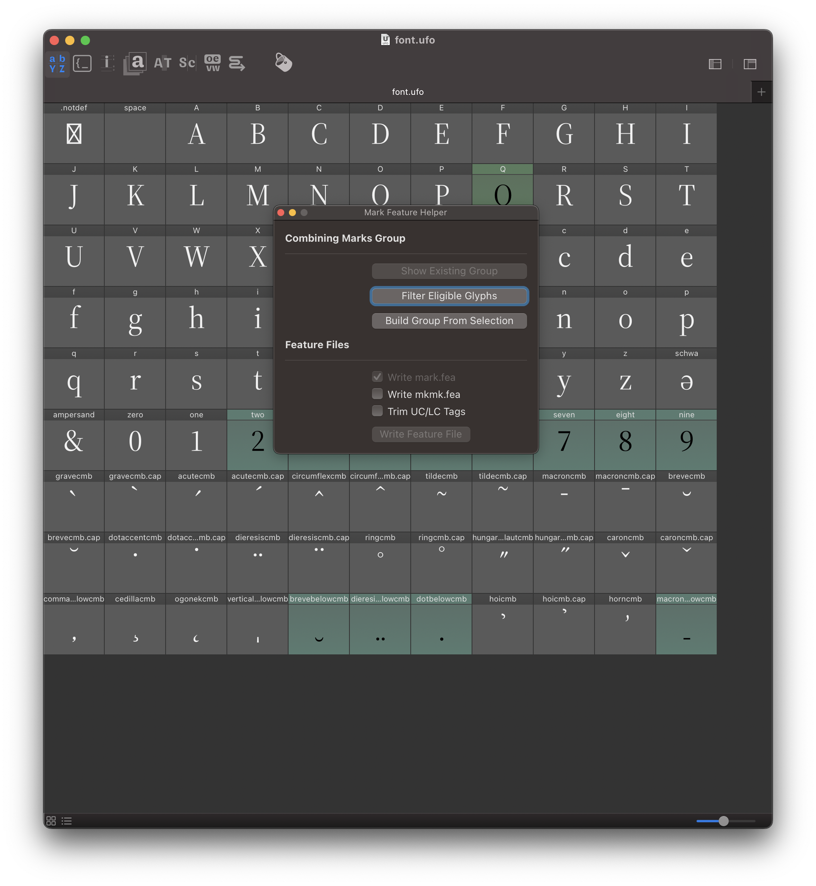
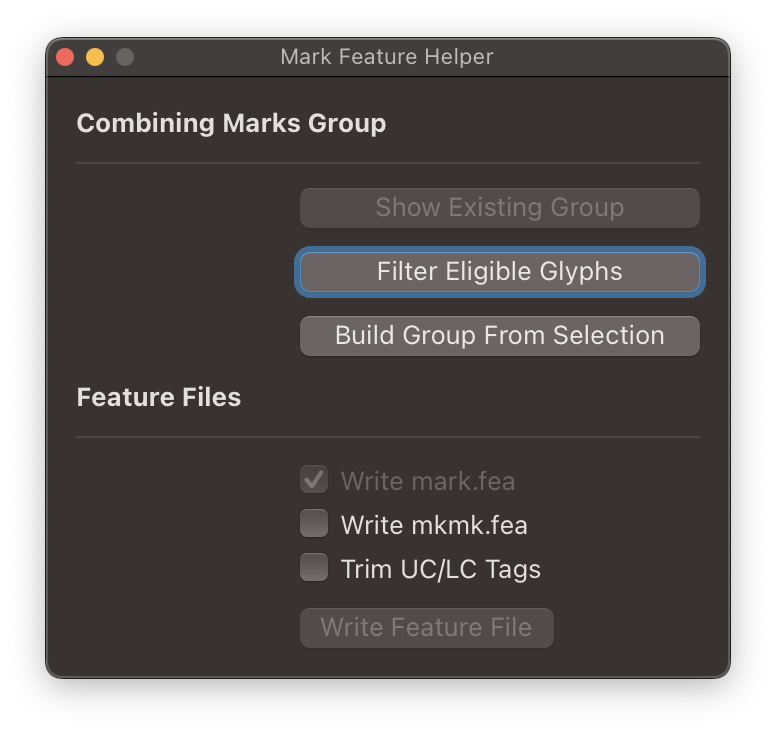
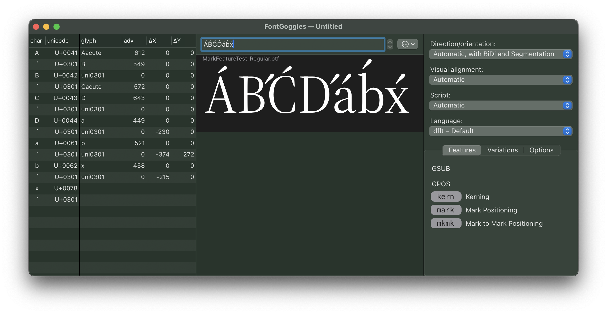
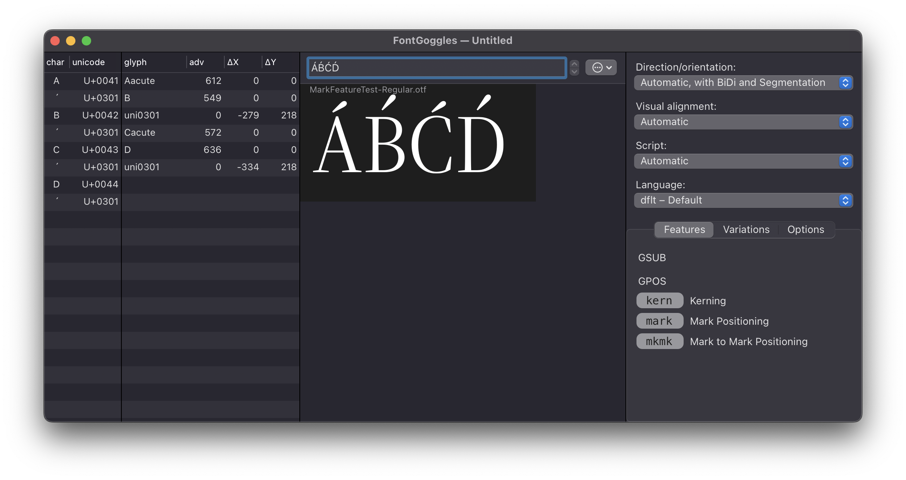
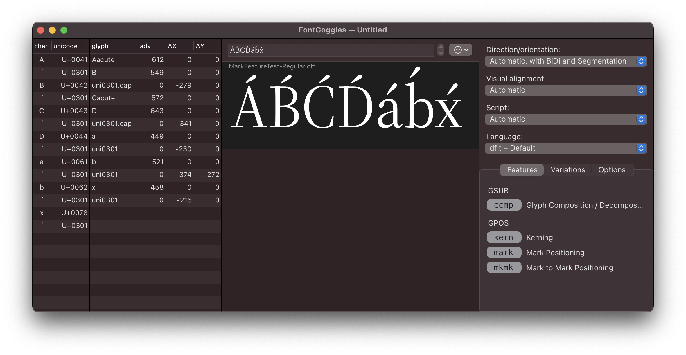
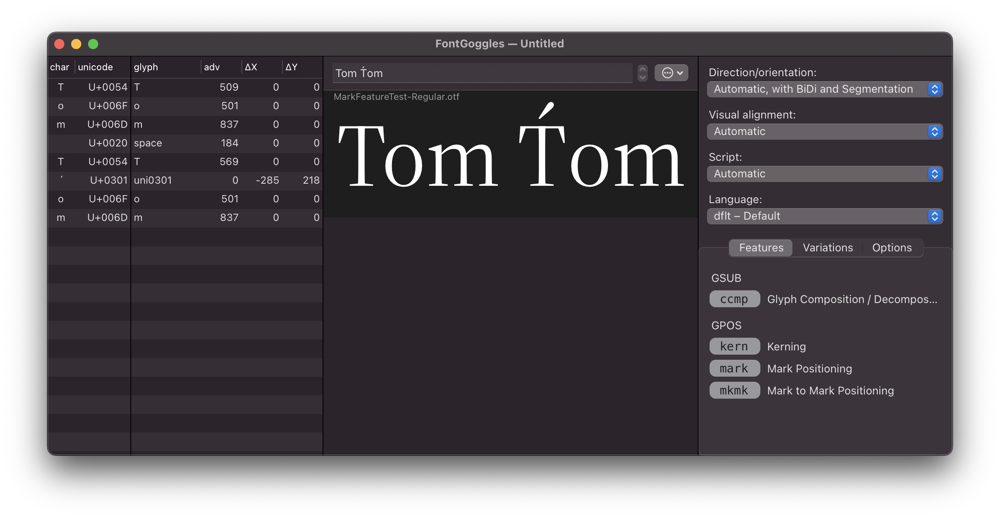
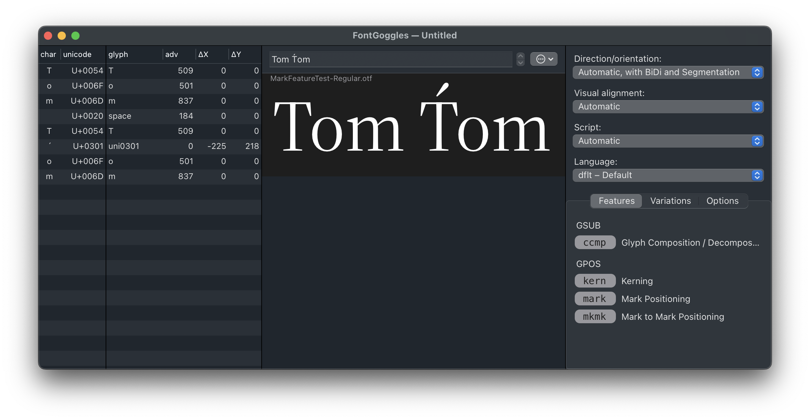

# Mark Feature Helper / Mark Feature Example

This repository is an attempt at making the authoring of a mark feature a bit more accessible.

It consists of
* a Mark Feature Helper Robofont Extension
* an [example project](example_project/) implementing the mark feature

---

The Mark Feature Helper looks like this:



The window basically is a little UI to the Adobe FDK’s [markFeatureWriter](https://github.com/adobe-type-tools/python-modules/tree/main?tab=readme-ov-file#markfeaturewriterpy) script.


There are two requirements for writing a mark feature:

* base glyphs and marks with corresponding anchors
* a group that helps the mark feature writer understand which glyphs are combining marks.

## Functionality of the Mark Feature Helper



### Placing Anchors

_This is not in the scope of this tool.
There have been many attempts at automating anchor placement, and most likely your UFO already has anchors. If it doesn’t, check Mechanic for the approach you like best._


### Building the `COMBINING_MARKS` group

The top of the helper has three buttons to help with defining a `COMBINING_MARKS` group in your UFO.

* `[Show Existing Group]` – filter the font overview to see the contents of this group, if it already exists. In our test project there is no such group – therefore the button is greyed out.

* `[Filter Eligible Glyphs]` – filter the font overview for glyphs that could make it into the `COMBINING_MARKS` group. Basically, this will be all zero-width glyphs with attaching anchors (`_top`, or `_above`, for example).  Be aware that this filter may find glyphs you really don’t want as combining marks.

* `[Build Group From Selection]` – this button adds the `COMBINING_MARKS` group to your UFO, after you have carefully considered which glyphs to include.


### Writing the `mark` feature file(s)

* After our UFO has a `COMBINING_MARKS` group, the `[Write Feature File]` button will become active. When we click it, a `mark.fea` file will be written next to the UFO file.

* Optionally, we can also write a `mkmk.fea` file – the contents of this file makes combinations like `x-acute-acute-acute-acute` possible.

* Another option is to trim casing tags – this is a very Adobe-ish approach and has to do with Latin being a bicameral script. More in the “ins and outs” section below.


#### NB
Both `mark.fea` and `mkmk.fea` are written in the “meat without the sandwich” style typical for the FDK. To test/compile the features, they need to be wrapped in feature “fences”:

```fea
feature mark {
    include(mark.fea);
} mark;

feature mkmk {
    include(mkmk.fea);
} mkmk;

```

The reason for this is to allow re-writing the features without having to edit a big feature tree.


## Ins and Outs of Mark Feature Writing

Writing a mark feature is a joyful activity, however there a number of caveats to consider.  
With a simple `mark.fea`, our example font will look like this:



What happened? 
* We entered the glyphs `A` `U+0301` `B` `U+0301` `C` `U+0301` `D` `U+0301` `a` `U+0301` `b` `U+0301` `x` `U+0301`
* The mark feature is working as expected (in some cases), attaching the combining acute (U+0301) to the anchor on the base glyph
* The layout engine is smart and thinks – “Ah! A combination of A and Acute! I know this and will therefore present the glyph for Aacute (U+00C1)” (I think that’s _Unicode normalization_)

Looking at the mark feature, we understand why:

```fea
markClass acutecmb <anchor 0 472> @MC_aboveLC;
markClass acutecmb.cap <anchor 0 690> @MC_aboveUC;

lookup MARK_BASE_aboveLC {
    pos base a <anchor 219 472> mark @MC_aboveLC;
    pos base b <anchor 147 744> mark @MC_aboveLC;
    pos base c <anchor 246 472> mark @MC_aboveLC;
} MARK_BASE_aboveLC;

lookup MARK_BASE_aboveUC {
    pos base A <anchor 304 690> mark @MC_aboveUC;
    pos base B <anchor 270 690> mark @MC_aboveUC;
    pos base C <anchor 345 690> mark @MC_aboveUC;
} MARK_BASE_aboveUC;
```

We have two mark `lookup`s, and two mark classes, with the lowercase marks attaching to the lowercase base glyphs, and the uppercase marks attaching to the uppercase base glyphs. Since the uppercase marks don’t have Unicode code points, there is just no way of typing them.


How to solve this problem?
* This is where the “trim casing tags” flag comes in. In many Adobe projects, anchors are assigned as `aboveUC` and `aboveLC`. This has the benefit that they can be used to combine accented glyphs within RoboFont. (`aboveUC` accents go on top of the caps, and `aboveLC` accents go on top of the lowercase). 
* Obviously, trimming casing tags is not necessary if you only use a single `top`/`_top` anchor pair for both upper- and lowercase.
* When trimming casing tags from `aboveUC`/`aboveLC` while writing the mark feature file, we end up with a simplified feature like this:

```fea
markClass acutecmb <anchor 0 472> @MC_above;
markClass acutecmb.cap <anchor 0 690> @MC_above;

lookup MARK_BASE_above {
    pos base A <anchor 304 690> mark @MC_above;
    pos base B <anchor 270 690> mark @MC_above;
    pos base C <anchor 345 690> mark @MC_above;
    pos base a <anchor 219 472> mark @MC_above;
    pos base b <anchor 147 744> mark @MC_above;
    pos base c <anchor 246 472> mark @MC_above;
} MARK_BASE_above;

```

Only one mark `lookup`, and a single mark class with both lowercase and uppercase marks attaching to the lowercase and uppercase base glyphs. The result:



What happened? 
* We entered the glyphs `A` `U+0301` `B` `U+0301` `C` `U+0301` `D` `U+0301`
* The mark feature is working as expected, attaching the combining acute (U+0301) to the anchor on the base glyph
* Pre-composed accented are normalized, while novel combinations just attach the literal combining mark. Since the normalized accented capitals are most likely composed with alternate accents (shallower angle, slightly smaller), this results in a mixed appearance.


How to solve this problem?
* We need to substitute marks on the fly – so the correct accent is attached to the respective base glyph. This can be done in the `ccmp` feature:

```fea
# very simplified, extended version in attached example project
feature ccmp {
    lookup CAP_ACCENT_SWAP {
        sub [ A B C D ] acutecmb' by acutecmb.cap;
    } CAP_ACCENT_SWAP;

} ccmp;
```

The result:


Amazing – the caps now all have uniform acutes. Check the b – probably you’d want a flatter acute there as well, which will make the `ccmp` a bit more complicated.

---

Is that all?
Not quite, there’s another caveat:



As we can see, the kerning between T and o is interrupted by the insertion of a combining mark. Fortunately, all we have to do is insert a `lookupflag` into the kerning like this:

```fea
feature kern {
    lookup KRN {
        lookupflag IgnoreMarks;
        include(kern.fea);
    } KRN;
} kern;
```



---

If you’ve read this far, you are truly re`mark`able … 🫣
